# Autonomous Robotic Coordination with TurtleBot3 and Niryo Ned2
<div style="text-align: center">
  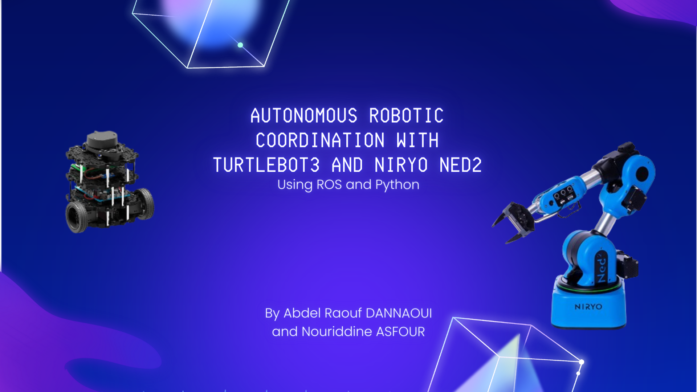
</div>

Authors:
  - Abdel Raouf Dannaoui 
  - Nouriddin Asfour

Supervisors:
 - Joaquin Jorge Rodriguez
 - Raphael Duverne


## Project Goal
<b>Experience seamless robotic collaboration with this project!</b><br>

Our TurtleBot3 autonomously navigates between yellow and white lines based on [Autorace Challenge][1], pausing when detecting an ArUco tag at a specific distance. Once halted, it signals Niryo to execute a precise pick-and-place task. After completion, TurtleBot3 resumes its journey until it encounters another ArUco tag, marking the end of the simulation. Dive into the world of robotic coordination for efficient and intelligent task execution.


## Project Workflow 
<div style="text-align: center">
  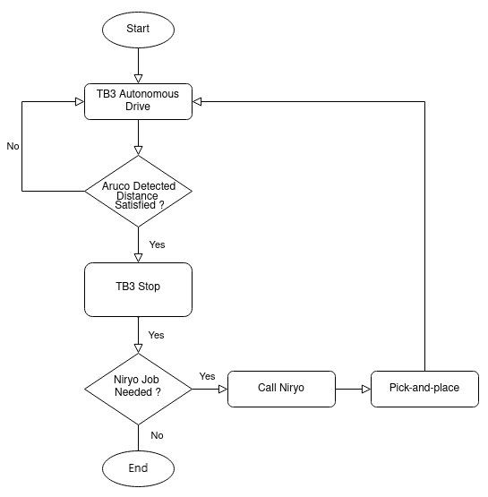
</div>


## Required Libraries and Packages to Start
- ros-noetic-image-transport 
- ros-noetic-cv-bridge 
- ros-noetic-vision-opencv 
- python3-opencv 
- libopencv-dev 
- ros-noetic-image-proc
- pyniryo
- pyniryo2


## Installing the Required Packages.
For this step we have followed the instructions provided on [emanual robotics][1], and then manipulated those packages to match our project goal. Start by installing our edited AutoRace 2020 meta package on your Remote PC.

```bash
cd ~/catkin_ws/src/
git clone https://github.com/RaoufDannaoui1/turtlebot3_with_niryo.git
cd ~/catkin_ws && catkin_make
```     
Install additional dependent packages on Remote PC.

```bash
sudo apt install ros-noetic-image-transport ros-noetic-cv-bridge ros-noetic-vision-opencv python3-opencv libopencv-dev ros-noetic-image-proc
pip install pyniryo
pip install pyniryo2
```


## TurtleBot3 Configuration
### Connection
Connect to the turtlebot3 thru the SSH on the specific IP and using `napelturbot` as password
```bash
ssh ubuntu@192.168.0.200
```

Once connected, do not forget to gring up your robot using

`TB3`
```bash
roslaunch turtlebot3_bringup turtlebot3_robot.launch 
```

### Intrinsic Camera Calibration
Here we used a big Checkerboard (size 8x6) to performe the intrinsic camera calibration. First we should turn on the camera on the TB3 

`Remote PC`
```bash
roscore
```
`TB3`
```bash
roslaunch turtlebot3_autorace_camera raspberry_pi_camera_publish.launch
```     

After launching the camera node, you can start the calilbration 

`Remote PC`
```bash
rosrun camera_calibration cameracalibrator.py --size 8x6 --square 0.108 image:=/camera/image camera:=/camera
```

Move the board in the x-axis, y-axis and, z-axis. Continue moving the board till the 4 bars get fully green. When succesfuly getting the bars green press on calibrate button as shown below.

<div style="text-align: center">
  
</div>

Now click on Save button as shown below  to save the calibration data. Then a `calibrationdata.tar.gz` folder will be created at ``/tmp`` folder. Extract `calibrationdata.tar.gz` folder, and open `ost.yaml`.

<div style="text-align: center">
  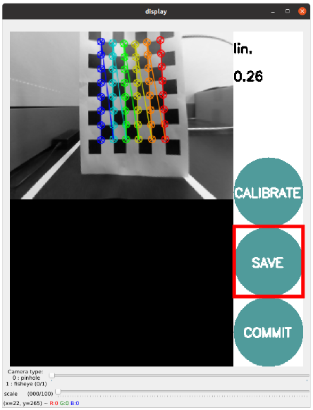
</div>

 Now copy and paste the data from `ost.yaml` to `camerav2_320x240_30fps.yaml` under the `intrinstic_calibration` folder in the `turtlebo3_autorace_camera` package

<div style="text-align: center">
  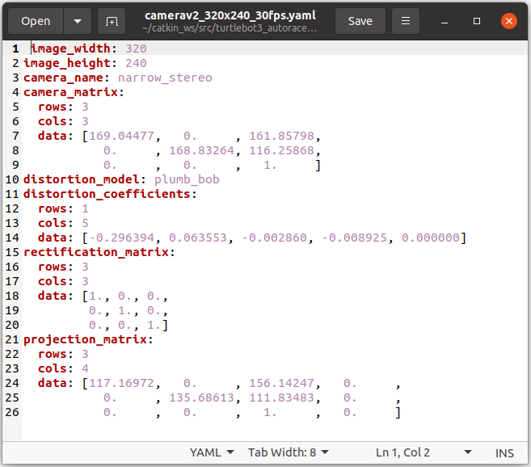
</div>


### Extrinsic Camera Calibration
The extrinsic camera calibration is quite straightforward. In order to detect the lanes as far as possible, we should adjust the projection view of the camera by adjusting the coordinates of the projection rectangle.


`Remote PC`
```bash
roscore
```

`TB3`
```bash
roslaunch turtlebot3_autorace_camera raspberry_pi_camera_publish.launch
```     

After launching the camera node, you can start the calilbration. Launch the intrinsic camera calibration node on action mode 

`Remote PC`
```bash
roslaunch turtlebot3_autorace_camera intrinsic_camera_calibration.launch mode:=action
```

Then Launch the extrinsic camera calibration node on calibration mode 

`Remote PC`
```bash
roslaunch turtlebot3_autorace_camera extrinsic_camera_calibration.launch mode:=calibration
```

Now to visualise the calibration use 

`Remote PC`
```bash
    rqt_image_view
```

Open multiple monitor and select `/camera/image_extrinsic_calib/compressed` and `/camera/image_projected_compensated` topics on each monitors. One of two screens will show an image with a red rectangle box. The other one shows the ground projected view (Bird’s eye view).

<div style="text-align: center">
  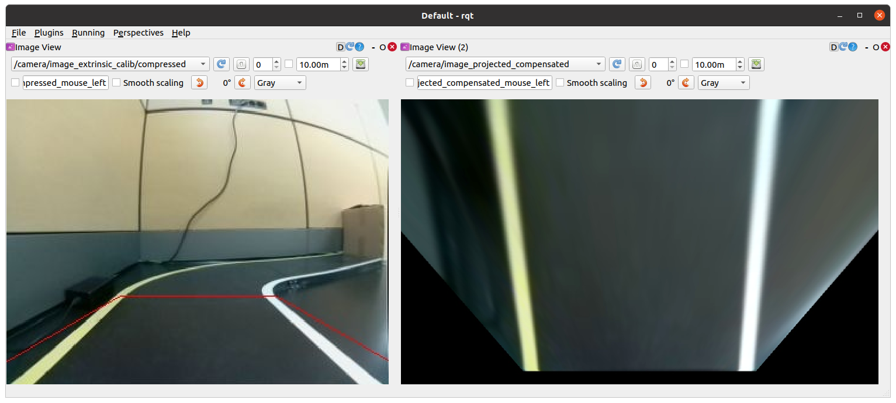
</div>

Excute rqt reconfiguration 

`Remote PC`
```bash
rosrun rqt_reconfigure rqt_reconfigure
```

Adjust parameters in `/camera/image_projection` and `/camera/image_compensation_projection`

<div style="text-align: center">
  
</div>

When you are satisfied by the results save the new values in `image_projection.yaml` and `compensation.yaml` under the `extrinstic_calibration` folder in the `turtlebo3_autorace_camera` package


### Check Calibration Result
After completing calibrations, run the step by step instructions below on `Remote PC` to check the calibration result.


Run the intrinsic camera calibration launch file
```bash
roslaunch turtlebot3_autorace_camera intrinsic_camera_calibration.launch mode:=action
```

Run the extrinsic camera calibration launch file
```bash
roslaunch turtlebot3_autorace_camera extrinsic_camera_calibration.launch mode:=action
```

Run the rqt to visualise the results
```bash
rosrun rqt_reconfigure rqt_reconfigure
```

<div style="text-align: center">
  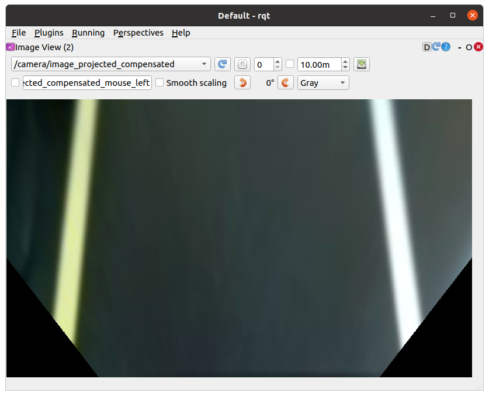
</div>


### Lane Detection
Lane detection package that runs on the `Remote PC` receives camera images from TurtleBot3 to detect driving lanes and to drive the Turtlebot3 along them.
The following instructions describe how to use and calibrate the lane detection feature via rqt

Launch roscore.

`Remote PC`
```bash
  roscore
```

Trigger the camera.

`TB3`
```bash
roslaunch turtlebot3_autorace_camera raspberry_pi_camera_publish.launch
```

Run a intrinsic camera calibration launch file on Remote PC.

`Remote PC`
```bash
roslaunch turtlebot3_autorace_camera intrinsic_camera_calibration.launch mode:=action
```

Run a extrinsic camera calibration launch file on Remote PC.

`Remote PC`
```bash
roslaunch turtlebot3_autorace_camera extrinsic_camera_calibration.launch mode:=action
```

Run a lane detection launch file on Remote PC

`Remote PC`
```bash
roslaunch turtlebot3_autorace_detect detect_lane.launch mode:=calibration
```

Now to visualise the calibration use 

`Remote PC`
```bash
rqt_image_view
```

Select three topics at each image view: `/detect/image_yellow_lane_marker/compressed`, `/detect/image_lane/compressed`, `/detect/image_white_lane_marker/compressed`

<div style="text-align: center">
  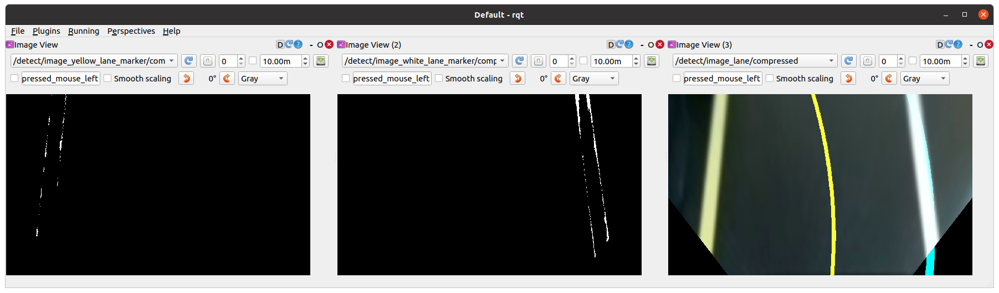
</div>

Left (Yellow line) and Right (White line) screen show a filtered image. Center screen is the view of the camera from TurtleBot3.

Excute rqt reconfiguration 

`Remote PC`
```bash
rosrun rqt_reconfigure rqt_reconfigure
```
<div style="text-align: center">
  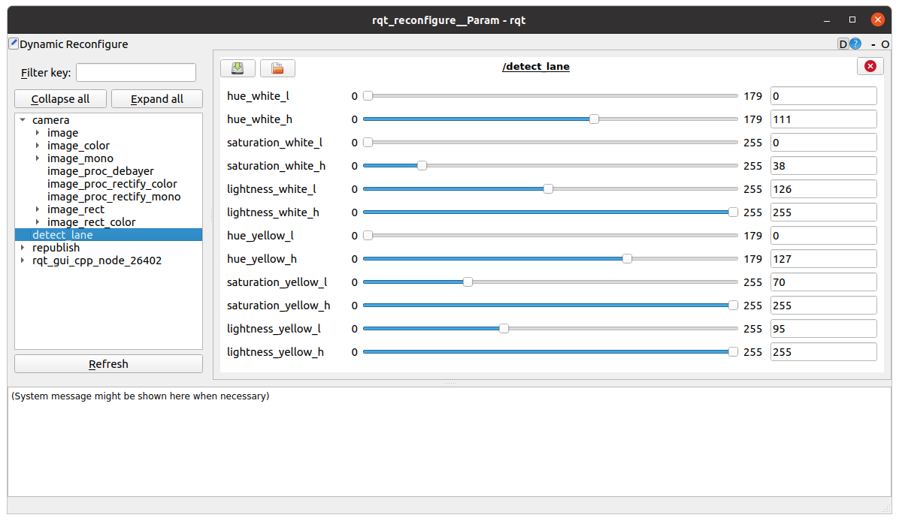
</div>

By default, the Turtlebot3 burger detects lane by identifying the left yellow lane and the
right white lane on a gray or black ground. In order to the yellow and white color, we
have to tune the HSL parameters for the 2 colors. After several adjustments, the blurry lanes become clearly identified

<div style="text-align: center">
  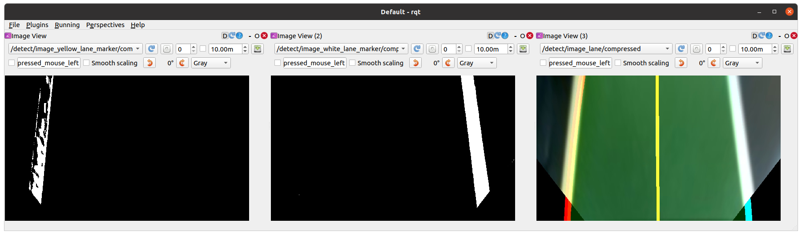
</div>

`TIP:` Calibration process of line color filtering is sometimes difficult due to physical environment, such as the luminance of light in the room and etc. To make everything quickly, put the value of `lane.yaml` file located in `turtlebot3autorace_detect/param/lane/` on the reconfiguration parameter, then start calibration. Calibrate hue low - high value at first. (1) Hue value means the color, and every colors, like `yellow`, `white`, have their own region of hue value (refer to hsv map). Then calibrate saturation low - high value. (2) Every colors have also their own field of saturation. Finally, calibrate the lightness low - high value. (3) In the source code, however, have auto-adjustment function, so calibrating lightness low value is meaningless. Just put the lightness high value to 255. Clearly filtered line image will give you clear result of the lane.

Open `lane.yaml` file located in `turtlebot3_autorace_detect/param/lane/`. You need to write modified values to the file. This will make the camera set its parameters as you set here from next launching

<div style="text-align: center">
  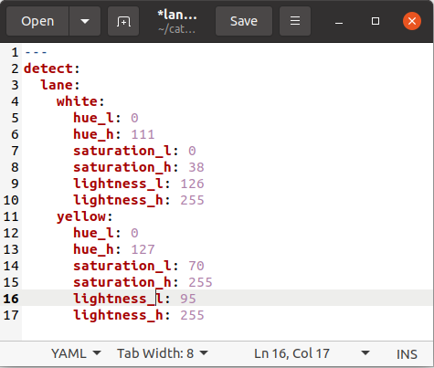
</div>

Check the results by running 

`Remote PC`
```bash
roslaunch turtlebot3_autorace_detect detect_lane.launch mode:=action
```

Run rqt
`Remote PC`
```bash
rqt_image_view
```

### Aruco tag detection

Using the camera on the TB3 we created an aruco tag detector which will detecte the tag and publish on `/aruco_distance` topic the distance between the robot and the aruco tag.

```python
#!/usr/bin/env python3

import rospy
import numpy as np
from cv_bridge import CvBridge
from std_msgs.msg import Float64
from sensor_msgs.msg import Image, CompressedImage
import cv2
from cv2 import aruco

class ArucoDetection:
    def __init__(self):
        rospy.init_node('aruco_detection', anonymous=True)
        self.bridge = CvBridge()
        self.image_sub = rospy.Subscriber('/camera/image/compressed', CompressedImage, self.image_callback)
        self.aruco_pub = rospy.Publisher('/aruco_markers', Image, queue_size=10)
        self.aruco_distance_pub = rospy.Publisher('/aruco_distance', Float64, queue_size=10)

        self.camera_matrix = np.array([[153.53337,   0.     , 150.50761],
                                      [0.       , 153.62598, 118.64754],
                                      [0.       ,   0.     ,   1.     ]])
        
        self.distortion_coefficients = np.array([-0.318094, 0.090092, 0.000346, -0.000410, 0.0])

    def image_callback(self, msg):
        try:
            cv_image = self.bridge.compressed_imgmsg_to_cv2(msg, 'bgr8')
            gray = cv2.cvtColor(cv_image, cv2.COLOR_BGR2GRAY)

            aruco_dict = aruco.Dictionary_get(aruco.DICT_6X6_250)
            parameters = aruco.DetectorParameters_create()
        
            corners, ids, _ = aruco.detectMarkers(gray, aruco_dict, parameters=parameters)
    
            if ids is not None:
                for i in range(len(ids)):
                    # print(f"Detected ArUco marker {ids[i]}")
                    rotation_vectors, translation_vectors, _ = aruco.estimatePoseSingleMarkers(corners[i], 0.05, self.camera_matrix, self.distortion_coefficients)

                    aruco.drawDetectedMarkers(cv_image, corners, ids)

                    distance_to_tag = np.linalg.norm(translation_vectors[0])
                    print(f"detected marker {ids[i]} at distance {distance_to_tag} meters")

                    self.aruco_distance_pub.publish(Float64(distance_to_tag))
                
                # Convert the image back to ROS format and publish it
                aruco_image_msg = self.bridge.cv2_to_imgmsg(cv_image, 'bgr8')
                self.aruco_pub.publish(aruco_image_msg)

        except Exception as e:
            rospy.logerr(f"Error processing image: {str(e)}")

if __name__ == '__main__':
    try:
        aruco_detection = ArucoDetection()
        rospy.spin()

    except rospy.ROSInterruptException:
        pass      
```
In this code we used `open-cv` to have the `aruco` features. Then from the intrinsic camera calibration we used the `camera matrix` and the `distortion coefficients` to have the exact distance between the tag and the TB3. Now this distance will be published on `/aruco_distance topic`


## Niryo Ned 2 Configuration
### Connection

Before Connecting to the Niro, we should reseve an IP for it on the router, and then connect to it thru the SSH on the specific IP and using `roboticcs` as password, in my case I'am using an ethernet to connect.
```bash
ssh niryo@192.168.0.150
```

open `.bashrc` file and add 

```bash
export ROS_MASTER_URI=http://192.168.0.100:11311
export ROS_HOSTNAME=192.168.0.150
```

save and and source it using 

```bash
source ./bashrc
```

Now open the Niryo Studion application on your pc and connect to the robot

<div style="text-align: center">
  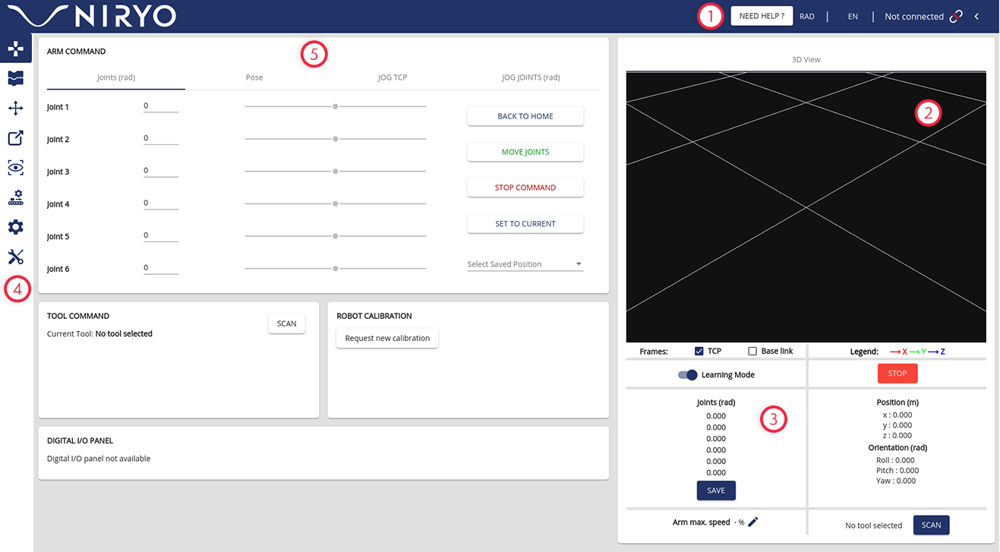
</div>

1. The top toolbar allows you to change the angle units, the language, and connect to Ned
2. 3D Ned visualization or camera stream video
3. State section and mode selection
4. The left menu allows you to switch between the different sections of the application
5. The main window of the application

### Calibration

Since Niryo is a smart manipulator it have an auto-calibration system with just one click.

### Program

Click the project button on the left menu to start creating and editing Blocky programs.

<div style="text-align: center">
  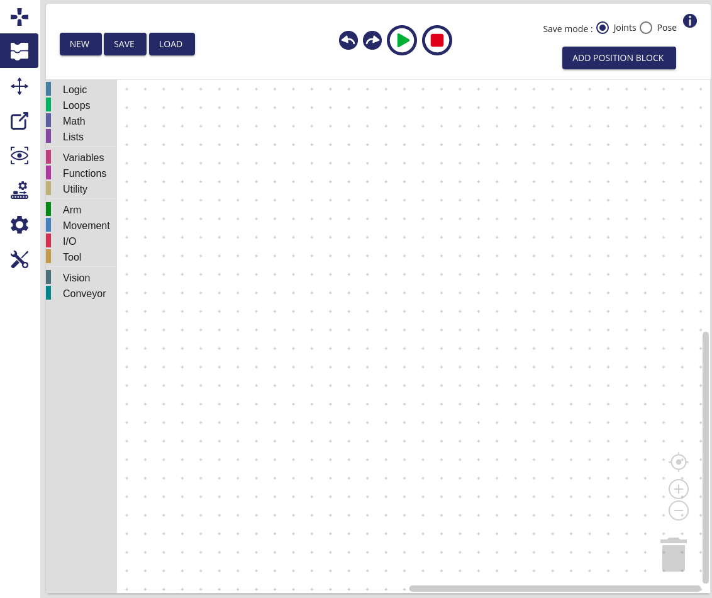
</div>

From here we select The `vision` tab and select a template to pick-and-place a block

So after getting the template we can save it and get the `python` code behind it

```python
#!/usr/bin/env python3
from pyniryo import *
import sys
import rospy
from std_msgs.msg import UInt8

class NiryoConnection:
   def __init__(self):
      rospy.init_node('niryo_connection', anonymous=True)

      self.sub_niryo = rospy.Subscriber('/niryo_con', UInt8, self.niryoCallBack, queue_size = 1)
      self.pub_niryo = rospy.Publisher('/niryo_con', UInt8, queue_size=10)
      self.counter = 0
   def niryoCallBack(self, msg):
      self.counter += 1
      if self.counter<=1:
         print(msg.data)
         if msg.data == 1:
            robot = NiryoRobot("192.168.0.150")

            try:
               # Move to an observation position then
               robot.move_pose(*[0.001, -0.213, 0.217, 3.1, 1.395, 1.559])
               # Try to do a vision pick:
               if robot.vision_pick('default_workspace_turltelbot', 0/1000.0, ObjectShape.CIRCLE, ObjectColor.RED)[0]:
                  # If an object has been taken, do:
                  robot.place_from_pose(*[0.326, -0.015, 0.314, -2.232, 1.471, -2.234])
                  robot.move_pose(*[0.326, -0.015, 0.364, -2.175, 1.476, -2.178])
                  robot.move_pose(*[0, -0.284, 0.325, 2.928, 1.346, 1.383])

            except NiryoRosWrapperException as e:
               sys.stderr.write(str(e))

            robot.close_connection()
            self.pub_niryo.publish(2)

if __name__ == '__main__':
   try:
      niryoCon = NiryoConnection()
      rospy.spin()

   except rospy.ROSInterruptException:
      pass
```
After some manupulation the `Niryo` will be subscribing to `/niryo_con` common topic between both robots. When the TB3 detect the `aruco tag` it will perform the pick-and-place task and then thru the publisher on the same topic, the TB3 will know that he finished and continue driving to its end position.

## Autonomous Robotic Coordination
### Expected Result
After setting both robots, now the `TB3` can drive from the starting point till a specific area where there's an aruco tag at a configured distance telling the `TB3` to stop and call the `Niryo`. When the `Niryo` is called, it will start the pick-and-place programe. After finishing it will signal to the `TB3` to continue his path to arive to another aruco tag marking the end of the job.

### Running the program
Open a terminal for the `TB3`

```bash
ssh ubuntu@192.168.0.200

roslaunch turtlebot3_bringup turtlebot3_robot.launch 

roslaunch turtlebot3_autorace_camera raspberry_pi_camera_publish.launch
```

Open a terminal for the `Niryo`

```bash
ssh niryo@192.168.0.150
```

Open a new terminal for the `Remote Pc` (every command in different terminal tab)

```bash
roscore

roslaunch turtlebot3_autorace_camera intrinsic_camera_calibration.launch mode:=action

roslaunch turtlebot3_autorace_camera extrinsic_camera_calibration.launch mode:=action

roslaunch turtlebot3_autorace_detect detect_lane.launch mode:=action

rosrun turtlebot3_autorace_driving aruco.py

rosrun turtlebot3_autorace_driving niryo.py

roslaunch turtlebot3_autorace_driving turtlebot3_autorace_control_lane.launch
```

Or simply run 

```bash
gnome-terminal --tab --title="roscore" --command="bash -c 'roscore; exec bash'" \
               --tab --title="intrinsic calibration" --command="bash -c 'roslaunch turtlebot3_autorace_camera intrinsic_camera_calibration.launch mode:=action; exec bash'" \
               --tab --title="extrinsic calibration" --command="bash -c 'roslaunch turtlebot3_autorace_camera extrinsic_camera_calibration.launch mode:=action; exec bash'" \
               --tab --title="detect lane" --command="bash -c 'roslaunch turtlebot3_autorace_detect detect_lane.launch mode:=action; exec bash'" \
               --tab --title="aruco.py" --command="bash -c 'rosrun turtlebot3_autorace_driving aruco.py; exec bash'" \
               --tab --title="niryo.py" --command="bash -c 'rosrun turtlebot3_autorace_driving niryo.py; exec bash'" \
               --tab --title="drive tb3" --command="bash -c 'roslaunch turtlebot3_autorace_driving turtlebot3_autorace_control_lane.launch; exec bash'" \
```


## Demo Videos
The below videos represent some tests on the TB3 autonomous drive in dark and light environment, in addition the the Niryo pick-and-place task.


| **Dark Environment** | **Light Environment** |
| -------------------- | --------------------- |
|  |  |


| **Pick and Place** |
| ------------------ |
|  |


| **Final Result** |
| ---------------- |
<video width="800" height="450" controls>
  <source src="/images/final_result.mp4" type="video/mp4">
</video>


[1]:https://emanual.robotis.com/docs/en/platform/turtlebot3/autonomous_driving/#autonomous-driving
