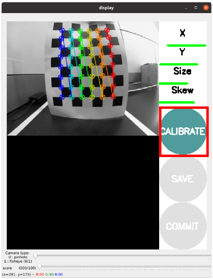

# Autonomous Robotic Coordination with TurtleBot3 and Niryo Ned2
<div style="text-align: center">
  
</div>

Authors:
  - Abdel Raouf Dannaoui 
  - Nouriddin Asfour

Supervisors:
 - Joaquin Jorge Rodriguez
 - Raphael Duverne


## Project Goal
<b>Experience seamless robotic collaboration with this project!</b><br>

Our TurtleBot3 autonomously navigates between yellow and white lines based on [Autorace Challenge][1], pausing when detecting an ArUco tag at a specific distance. Once halted, it signals Niryo to execute a precise pick-and-place task. After completion, TurtleBot3 resumes its journey until it encounters another ArUco tag, marking the end of the simulation. Dive into the world of robotic coordination for efficient and intelligent task execution.


## Project Workflow 
<div style="text-align: center">
  
</div>


## Required Libraries and Packages to Start
- ros-noetic-image-transport 
- ros-noetic-cv-bridge 
- ros-noetic-vision-opencv 
- python3-opencv 
- libopencv-dev 
- ros-noetic-image-proc
- pyniryo
- pyniryo2


## Installing the Required Packages.
For this step we have followed the instructions provided on [emanual robotics][1], and then manipulated those packages to match our project goal. Start by installing our edited AutoRace 2020 meta package on your Remote PC.

```bash
cd ~/catkin_ws/src/
git clone https://github.com/RaoufDannaoui1/turtlebot3_with_niryo.git
cd ~/catkin_ws && catkin_make
```     
Install additional dependent packages on Remote PC.

```bash
sudo apt install ros-noetic-image-transport ros-noetic-cv-bridge ros-noetic-vision-opencv python3-opencv libopencv-dev ros-noetic-image-proc
pip install pyniryo
pip install pyniryo2
```


## TurtleBot3 Configuration
### Connection
<div style="padding: 0 30px">

Connect to the turtlebot3 thru the SSH on the specific IP and using `napelturbot` as password
```bash
ssh ubuntu@192.168.0.200
```

Once connected, do not forget to gring up your robot using

`TB3`
```bash
roslaunch turtlebot3_bringup turtlebot3_robot.launch 
```
</div>

### Intrinsic Camera Calibration
<div style="padding: 0 30px">

Here we used a big Checkerboard (size 8x6) to performe the intrinsic camera calibration. First we should turn on the camera on the TB3 

`Remote PC`
```bash
roscore
```
`TB3`
```bash
roslaunch turtlebot3_autorace_camera raspberry_pi_camera_publish.launch
```     

After launching the camera node, you can start the calilbration 

`Remote PC`
```bash
rosrun camera_calibration cameracalibrator.py --size 8x6 --square 0.108 image:=/camera/image camera:=/camera
```

Move the board in the x-axis, y-axis and, z-axis. Continue moving the board till the 4 bars get fully green. When succesfuly getting the bars green press on calibrate button as shown below.

<div style="text-align: center">
  
</div>

Now click on Save button as shown below  to save the calibration data. Then a `calibrationdata.tar.gz` folder will be created at ``/tmp`` folder. Extract `calibrationdata.tar.gz` folder, and open `ost.yaml`.

<div style="text-align: center">
  
</div>

 Now copy and paste the data from `ost.yaml` to `camerav2_320x240_30fps.yaml` under the `intrinstic_calibration` folder in the `turtlebo3_autorace_camera` package

<div style="text-align: center">
  
</div>

</div>


### Extrinsic Camera Calibration
<div style="padding: 0 30px">
The extrinsic camera calibration is quite straightforward. In order to detect the lanes as far as possible, we should adjust the projection view of the camera by adjusting the coordinates of the projection rectangle.

Launch the intrinsic camera calibration node on action mode 

`Remote PC`
```bash
roslaunch turtlebot3_autorace_camera intrinsic_camera_calibration.launch mode:=action
```

Then Launch the extrinsic camera calibration node on calibration mode 

`Remote PC`
```bash
roslaunch turtlebot3_autorace_camera extrinsic_camera_calibration.launch mode:=calibration
```

Now to visualise the calibration use 

`Remote PC`
```bash
    rqt_image_view
```

Open multiple monitor and select `/camera/image_extrinsic_calib/compressed` and `/camera/image_projected_compensated` topics on each monitors. One of two screens will show an image with a red rectangle box. The other one shows the ground projected view (Bird’s eye view).

<div style="text-align: center">
  
</div>

Excute rqt reconfiguration 

`Remote PC`
```bash
rosrun rqt_reconfigure rqt_reconfigure
```

Adjust parameters in `/camera/image_projection` and `/camera/image_compensation_projection`

<div style="text-align: center">
  
</div>

When you are satisfied by the results save the new values in `image_projection.yaml` and `compensation.yaml` under the `extrinstic_calibration` folder in the `turtlebo3_autorace_camera` package
</div>


### Check Calibration Result
<div style="padding: 0 30px">

After completing calibrations, run the step by step instructions below on `Remote PC` to check the calibration result.


Run the intrinsic camera calibration launch file
```bash
roslaunch turtlebot3_autorace_camera intrinsic_camera_calibration.launch mode:=action
```

Run the extrinsic camera calibration launch file
```bash
roslaunch turtlebot3_autorace_camera extrinsic_camera_calibration.launch mode:=action
```

Run the rqt to visualise the results
```bash
rosrun rqt_reconfigure rqt_reconfigure
```

<div style="text-align: center">
  
</div>

</div>


## Demo Videos

| Dark Environment | Light Environment | Pick and Place | Final Demo |
| :--------------: | :---------------: | :------------: | :--------: |
|  |  |  |  |


[1]:https://emanual.robotis.com/docs/en/platform/turtlebot3/autonomous_driving/#autonomous-driving
